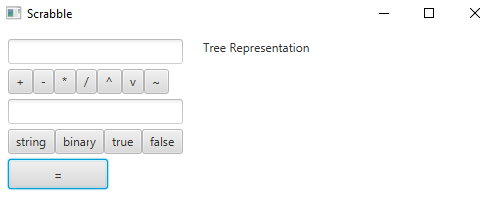
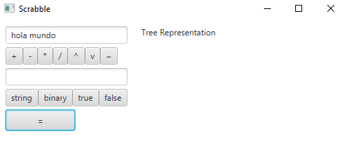
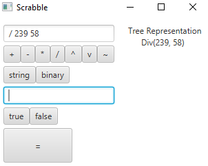
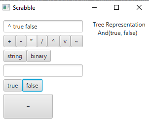

# Scrabble

Interactive graphic programming language heavily inspired by 
[Scratch](https://scratch.mit.edu).
This work is licensed under a
[Creative Commons Attribution 4.0 International License](http://creativecommons.org/licenses/by/4.0/), 
and aims purely to be used with the purpose of teaching in the context of the course 
_CC3002 Metodologías de Diseño y programación_ of the 
[_Computer Sciences Department (DCC)_](https://www.dcc.uchile.cl) of the 
_University of Chile_.

---

## Summary
	
The objective of this project is to recreate a simplified version of Scratch developed by 
[_Scratch Foundation_] (https://scratch.mit.edu/). The idea is to be able to create a programming enviroment where
the user can create applications without needing knowledge on programming languages. The project will be developed in Java.

## Getting Started

Following the instructions of this repository will get you a copy of the project so you can 
run and test in your personal machine

## Prerequisites

-Java 11 or superior recommended
-JUnit 5 or superior for testing
-Intellij IDE to work and launch
-Gradle Build Tools or Maven

## Installing and Running tests
Cloning the repository or downloading the zip file with the content will get you a copy of the project.
Since throughout the project a migration to maven was made, now to run all
the test you need to execute maven goal test.

## Data types

For this project we will work with 3 basic types of data: _Strings_, _Booleans_ and _Numbers_
where numbers will be subdivided in: _floats_, _integers_ and _binaries_.

## Making it work
In this section it will be detailed how to make the application run on your computer
and how to make use of the calculator.

first of all to make it run and actually appear on your screen you need to open
the project with intelliJ and then there are two ways to run the app, one
is to execute maven goal javafx:run or the other is to directly execute
app.main() class situated in the gui package.

Once you get that running you should have something like this on your screen

It is important to note that this calculator follows prefix notation, that means that the operations are noted before
the operands, eg. + 1 2 = 3, so inputs should be made in the same manner.

For example

the upper text bar will show what you are inputing up to that moment, indicated with a red arrow
and the text bar below works as the input where you type the numbers or strings to be calculated.
to input a value you just have to type in the bar and press enter. If what you want to input is a string or a binary
number you need to click on the respective button indicating the type of input before pressing enter, else you can
get an error or not get the result one would expect.

To the side there is a visual representation of the operation tree up to the moment before pressing "=" to get the result

And the result after pressing the "=" button

it is important to note that at this point in development it is still not possible to make multiple operations
in one line as recursive assignation of operations on the main operation tree has been a challenge. So only simple binary
and unary operations can be done on the calculator right now.

## Work

The project is structured in partial progressive assignments and that's how it will be documented for revision.

### 1st assignment

The first assignments was to implement the types system for Scrabble using Java native types to emulate their behauvior.
This way get a Java class for every type to be implemented and every one of these classes have their main value 
represented with a Java native as shown here:

-ScrabbleBool represented by a _Java_ Bool
-ScrabbleString represented by a _Java_ String
-ScrabbleFloat represented by a _Java_ double
-ScrabbleInt represented by a _Java_ int
-ScrabbleBinary represented by a _Java_ String of bits

Once we had Scrabble types the next step was to implement transformation operations for every Scrabble type following
a table that indicated which transformation was valid or not.

At this stage of the project, everything was implemented using Java Intefaces to group types in a convenient way.

### 2nd assignment  
For this next stage we had to implement operation betweeen Scrabble types. For this almost everything was acomplished
by making use of double dispatch and returning according to the indications for which operations where valid and returning
<null> for those that weren't

Aside from this the only assumption that was made was that since String can concatenate with everything but only when the operation
is done with an String on the left, the operations _Addition_ and _Concatenation_ were separated. Different to 
how originally was indicated in the instructions. leaving _concatenation_ to be implemented by itself but be applicated on
every type as long as an ScrabbleString makes the call on other types, not the other way around.

### Note

The project has been developed to this point for now waiting for further instructions to continue working on it. 

### 3rd assignment
For this stage the objective was to represent operations as trees that contained Scrabble types as arguments for every operation.
Every operation was successfully implemented allowing to apply transformation on nodes and performing the corresponding operations
on each of the nodes of the tree.

### 4th assignment
An Scrabble type builder with cache was implemented to create every type required
and save them in a hashMap binded by an id so they can be accessed every time it is needed
as a way to save memory.

### Final assignment
For the final assignment a visual interface was to be implemented to represent a calculator
that was able to work with scrabble types and show a graphic representation of 
the abstract syntax tree that represents the operations. This was done using JavaFX libraries
following an model-view-controller pattern of developing where the model is every
scrabble type implemented with their logic, a controller that took advantage of the 
AST implemented to communicate with the visual representation of a calculator.
Sadly only simple binary operations can be done right now as recursion to add variables
to the operations tree has been a challenge. This means that for now only
operations like Add(1,2), Mul(4,5), or Neg(true) can be done. 

### Example Images

 